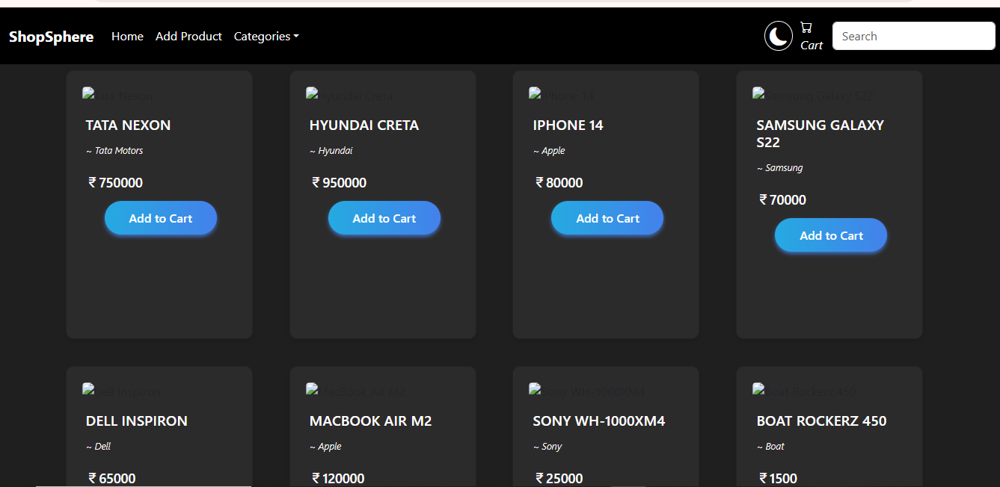
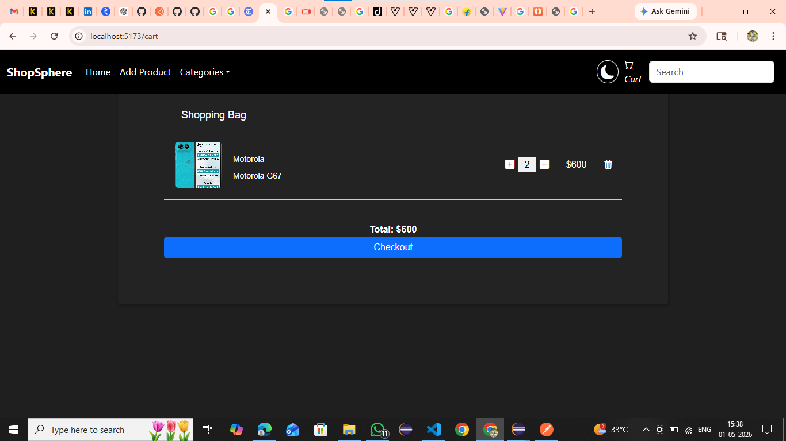
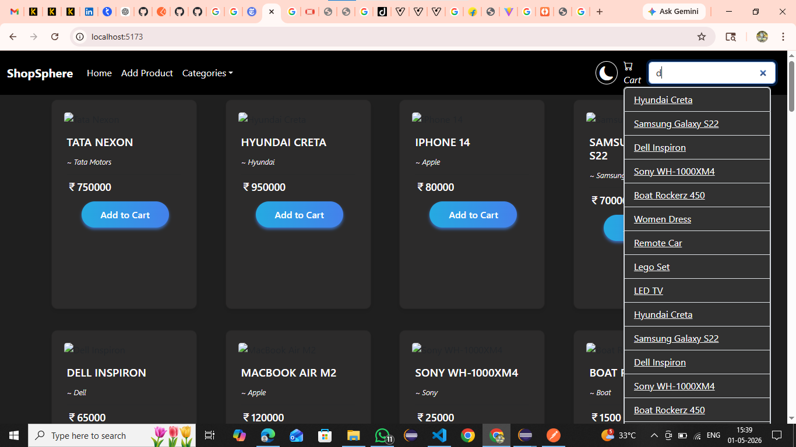

# 🛒 ShopSphere - Full Stack E-commerce Application

A full-stack e-commerce web application built using **React (Vite)** and **Spring Boot**, where users can browse products, add new products with images, and filter/search by categories.

---

## 🚀 Features

* 🛍 View all products
* ➕ Add product with image upload
* 🗂 Category-based filtering
* 🔍 Search functionality
* 🖼 Display product images from backend
* 🔄 REST API integration
* ⚡ Fast UI with Vite

---

## 🛠 Tech Stack

### 🔹 Frontend

* React (Vite)
* CSS

### 🔹 Backend

* Spring Boot
* Spring Data JPA
* REST APIs

### 🔹 Database

* H2 (File-based database)

---

## 📁 Project Structure

```bash
ShopSphere-Ecommerce/
│
├── Ecommerce-Backend/
│   ├── src/main/java/com/cart/ecom_proj/
│   ├── src/main/resources/
│   └── pom.xml
│
├── Ecommerce-Frontend/
│   ├── src/
│   ├── public/
│   └── package.json
│
└── README.md
```

---

## ▶️ How to Run Locally

### 🔹 Backend (Spring Boot)

1. Open **Ecommerce-Backend** in Eclipse / IntelliJ
2. Run the application

OR using terminal:

```bash
mvn spring-boot:run
```

Backend runs on:

```
http://localhost:8082
```

---

### 🔹 Frontend (React)

```bash
cd Ecommerce-Frontend
npm install
npm run dev
```

Frontend runs on:

```
http://localhost:5173
```

---

## 🔗 API Endpoints

| Method | Endpoint                  | Description            |
| ------ | ------------------------- | ---------------------- |
| GET    | `/api/products`           | Get all products       |
| GET    | `/api/product/{id}`       | Get product by ID      |
| POST   | `/api/product`            | Add product with image |
| PUT    | `/api/product/{id}`       | Update product         |
| DELETE | `/api/product/{id}`       | Delete product         |
| GET    | `/api/product/{id}/image` | Fetch product image    |

---

## 🖼 Image Handling

* Images are uploaded using **multipart/form-data**
* Stored as **byte[] in database**
* Retrieved via REST API and rendered in frontend

---

## 📸 Screenshots

```md





```

---

## ⚠️ Important Notes

* H2 database is configured as **file-based** for persistence
* Database files are excluded using `.gitignore`
* Make sure backend is running before frontend

---

## 🌐 Future Improvements

* 🔐 Authentication (Login/Register)
* 🛒 Cart system with persistence
* 💳 Payment integration
* 📄 Pagination & sorting
* ☁️ Deployment (Render + Vercel)

---

## 👨‍💻 Author

**Nikhil Ramesh Mali**

---

## ⭐ If you like this project

Give it a ⭐ on GitHub and feel free to contribute!
